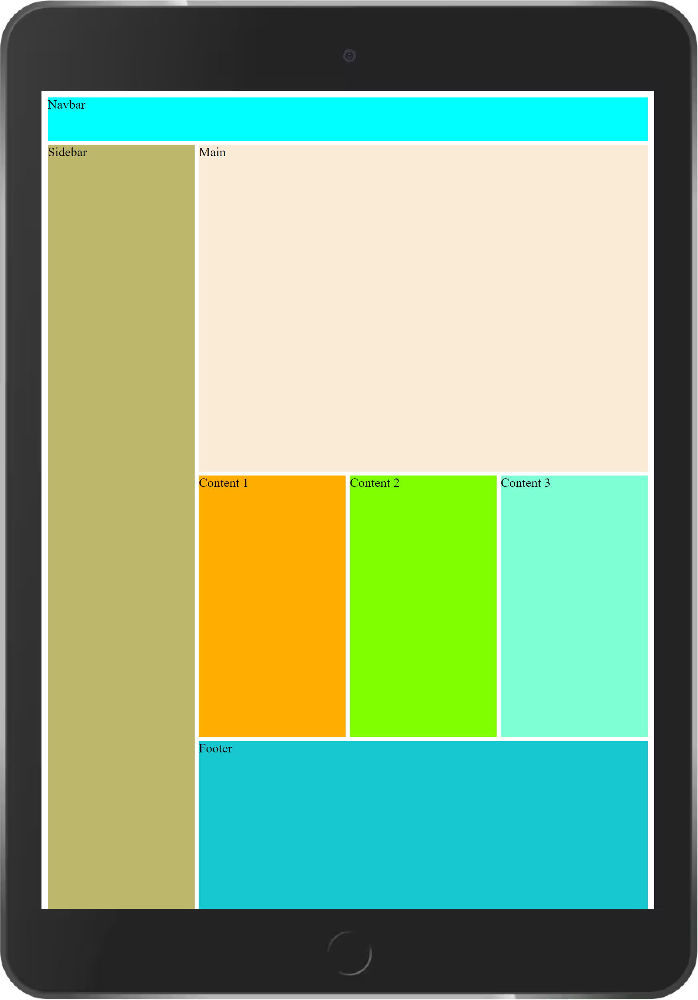

# Using CSS Grid Layout
## Step guide
- Create a div with a class of container
`<div class="container"> </div>` all other div will be nested in the container class.
Check you have created all elements on of the page. 

- All other working is going to be completed using CSS.
- In styling:
### a. give our container a display of grid:
We asign a height of 100vh, so that it span the whole device 100%.

    .container{
        display:grid
        height:100vh
        grid-template-column:1fr 1fr 1fr 1fr
    }

#### Output of `height:100vh`, spanning to fit the device viewport


#### Output of `grid-template-column:1fr 1fr 1fr 1fr`


### c. We define the Grid-template-row and assign
This determines the number of rows we will have in our design
`grid-template-rows: 0.2fr 1.5fr 1.2fr 0.8fr;`
The output looks as below:


### d. Add  `background-color:` property to every layout, 
```
nav{
    background-color: aqua;
}
main{
    background-color: antiquewhite;
}
#content1{
    background-color: rgb(255, 174, 0);
}
#sidebar{
    background-color: darkkhaki;
}
#content2{
    background-color:chartreuse ;
}
#content3{
    background-color: aquamarine;
}
footer{
    background-color: rgb(24, 200, 209);
}
```


### Grid template area definition
```
grid-template-areas: 
        "nav nav nav nav"
        "sidebar main main main"
        "sidebar content1 content2 content3"
        "sidebar footer footer footer" ;

```
- you have to define each area for reference, 

#### Output after grid area definition


### We want to add spaces between each column and rows
- To achieve this we use `grid-gap:` property in our `.container{}` class


#### final `.container:` class style looks like:
```
.container{
    display: grid;
    height: 100vh;
    grid-template-columns: 1fr 1fr 1fr 1fr;
    grid-template-rows: 0.2fr 1.5fr 1.2fr 0.8fr;
    grid-template-areas: 
            "nav nav nav nav"
            "sidebar main main main"
            "sidebar content1 content2 content3"
            "sidebar footer footer footer" ;
    grid-gap: 5px;
}
```

## Responsive Design
In this design, we make everything in one column. Below are sample responsive on various device screen sizes:
### a. Large Screen size- Desktops

### a. Medium Screen size- Tablets

### a. Small screen sizes-Smartphones
